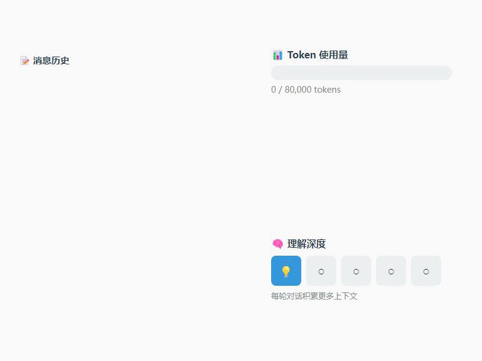

大家好，我是小松鼠。

一名AI时代的学习者，专注探索个体在新时代的生存模式。

这是我的第 16 篇 AIGC 文章。

---

想自己写一个 AI Agent，从哪下手？

市面上框架太多了，LangChain、AutoGPT、CrewAI...

一个比一个复杂，看完更懵。

今天我用一个 500 行的开源项目，带你搞懂 Agent 的核心原理。

看完你能自己写一个命令行 AI 助手。

真没那么玄乎。

---

一、记住一句话

Agent = LLM + Plan + Tools + Memory

这是核心公式，所有 Agent 框架都逃不出这个套路。

翻译一下：

- LLM：大脑，负责思考决策
- Plan：规划，决定先干什么后干什么
- Tools：工具，实际干活的
- Memory：记忆，记住聊过什么

今天要拆解的项目叫 Mini-Agent，MiniMax 官方出品。

麻雀虽小，五脏俱全。

---

二、Agent 的本质：一个 while 循环


Agent 的核心逻辑简单到离谱：

```python
while step < max_steps:
    # 1. 问 LLM：接下来干嘛？
    response = llm.generate(messages, tools)

    # 2. LLM 说不用工具了 → 任务完成
    if not response.tool_calls:
        return response.content

    # 3. LLM 说要用工具 → 执行工具，继续循环
    for tool_call in response.tool_calls:
        result = tool.execute(**arguments)
        messages.append(tool_result)

    step += 1
```

就这么简单。

AI 圈最擅长造词营销了，什么 ReAct、CoT、自主决策...

说白了就是个 while 循环。

---

三、四种结局，必须都考虑

这个循环什么时候停？

1️⃣ **正常完成**：LLM 说"活干完了"，不再调工具

2️⃣ **步数上限**：跑了 50 次还没完？强制停止，防止烧光 token

3️⃣ **用户取消**：按 Esc 打断，代码里有 3 个检查点

4️⃣ **API 挂了**：重试 3 次都失败，抛异常

这 4 种边界条件必须处理，否则上线就是灾难。

---

四、Memory：三层记忆机制



Agent 怎么"记住"之前聊过的内容？

Mini-Agent 用了三层机制：

**第一层：短期记忆**

```python
self.messages = [system_prompt]  # 初始化
self.messages.append(user_msg)   # 追加用户消息
self.messages.append(assistant_msg)  # 追加 LLM 响应
```

就是一个 Python 列表，程序退出就没了。

**第二层：摘要压缩**

聊太久，token 会爆。

解决方案：自动摘要。

```
原始：user1 → assistant1 → tool1 → tool2 → user2 → ...
压缩：user1 → summary1 → user2 → summary2 → ...
```

保留用户消息（意图不能丢），压缩执行过程。

**第三层：长期记忆**

Agent 可以主动调用 `record_note()` 把重要信息写到 JSON 文件。

下次启动还能读回来。

```python
record_note("用户偏好简洁回复", category="preference")
```

说人话：短期记忆是对话记录，摘要是总结，长期记忆是小本本。

---

五、工具系统：统一接口

所有工具继承同一个基类：

```python
class Tool:
    @property
    def name(self) -> str: ...      # 工具名
    @property
    def description(self) -> str: ... # 描述（给 LLM 看）
    @property
    def parameters(self) -> dict: ... # 参数定义

    async def execute(self, **kwargs) -> ToolResult: ...  # 执行
```

想加新工具？两步搞定：

```python
# 1. 写一个类
class EmailTool(Tool):
    name = "send_email"
    async def execute(self, to, subject, body):
        # 发送逻辑
        return ToolResult(success=True, content="已发送")

# 2. 注册
tools.append(EmailTool())
```

这就是好架构的价值——扩展成本极低。

---

六、完整执行流程


用户输入"帮我创建 hello.py"，代码怎么跑的？

```
① CLI 层：接收输入 → 加入消息历史
② Agent 层：进入 while 循环
③ LLM 层：调用大模型，返回"用 write 工具"
④ Tools 层：执行 write 工具，创建文件
⑤ 循环继续：LLM 说"完成了"，退出循环
⑥ 返回结果："文件已创建"
```

每一步都有对应代码，都能追溯。

---

七、和 LangChain 的区别

LangChain 是目前最火的 Agent 框架，它和 Mini-Agent 有什么区别？

| 维度 | Mini-Agent | LangChain |
|------|------------|-----------|
| 代码量 | 500 行 | 数万行 |
| 抽象层级 | 1-2 层 | 5-6 层（Chain、Agent、Tool、Memory...） |
| 学习曲线 | 半天看懂 | 一周入门 |
| 适用场景 | 快速验证、学习原理 | 生产级复杂应用 |
| 生态 | 基础 | 丰富（Prompt Templates、Vector Stores...） |

LangChain 做了什么优化？

1. **更丰富的记忆系统**：ConversationBufferMemory、VectorStoreMemory 等
2. **链式调用**：多个 LLM 调用可以串联
3. **LCEL**：LangChain Expression Language，声明式组合
4. **多 Agent 协作**：LangGraph 支持复杂工作流

但 LangChain 的问题是：过度抽象。

很多人用 LangChain 写 demo 很快，但出了 bug 完全不知道怎么调试。

因为层层封装把核心逻辑藏太深了。

我的建议：

先读懂 Mini-Agent，理解原理。

再决定要不要用 LangChain。

---

八、从零实现，需要什么？

如果你要自己写一个 CLI Agent，最小可用版本需要：

**必须有的**：
- Agent Loop（while 循环）
- LLM 调用（能和模型对话）
- 1 个 Tool（至少能干一件事）

**建议有的**：
- 重试机制（API 不稳定是常态）
- 消息历史（不然每次都是新对话）

**锦上添花**：
- 消息摘要（长任务才需要）
- MCP 协议（扩展工具生态）
- 配置系统（多环境部署）

先把核心跑通，其他的慢慢加。

---

九、总结

Agent 的本质：

```
Agent = LLM + Plan + Tools + Memory
      = 大脑 + while 循环 + 工具调用 + 消息历史
```

核心代码不过 100 行。

剩下的 400 行都是工程细节：重试、摘要、配置、边界处理。

而这些细节，才是区分"能跑"和"能用"的关键。

孩子们，现在你知道为什么很多 Agent 教程看完还是不会做了吧~~

因为他们只讲概念，不讲工程。

我的建议：

把 Mini-Agent 克隆下来，自己跑一遍。

然后试着写一个自己的 Agent。

用起来，用着用着就懂了。

收藏着，关注着。

---

看到这里了，如果觉得不错：

✓ 点个「赞」，让我知道你在看
✓ 点个「在看」，分享给更多朋友
✓ 点个「转发」，帮助更多人
✓ 加个「星标⭐」，第一时间收到推送

也可以加我的个人微信围观学习：archerqc

小松鼠爱你们！
